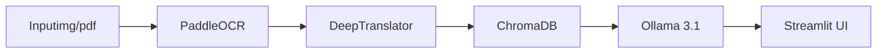

# Personal Archive RAG Application

A Streamlit based document archive with RAG capabilities, able to digitize, translate and query Romanian documents using
Llama 3.1.

### Overview

```mermaid
flowchart LR
    A[Inputimg/pdf] --> B[PaddleOCR] --> C[DeepTranslator] --> D[ChromaDB] --> E[Ollama 3.1] --> F[Streamlit UI]
```